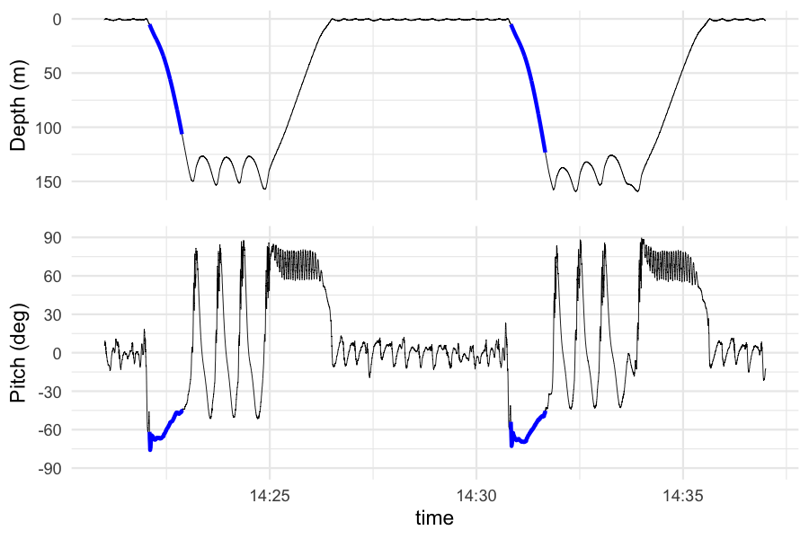
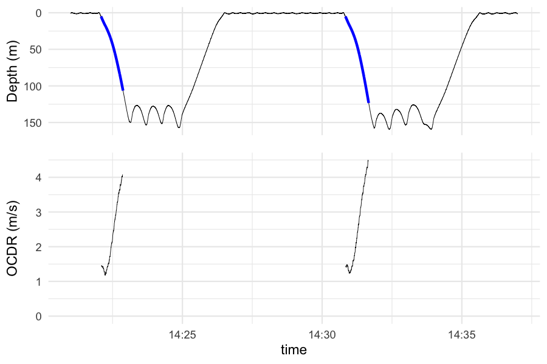
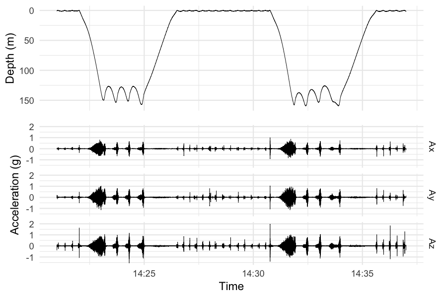
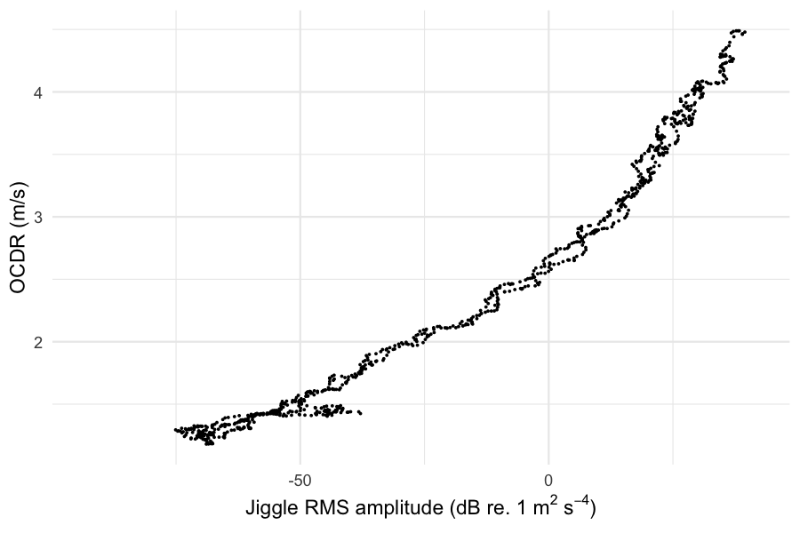
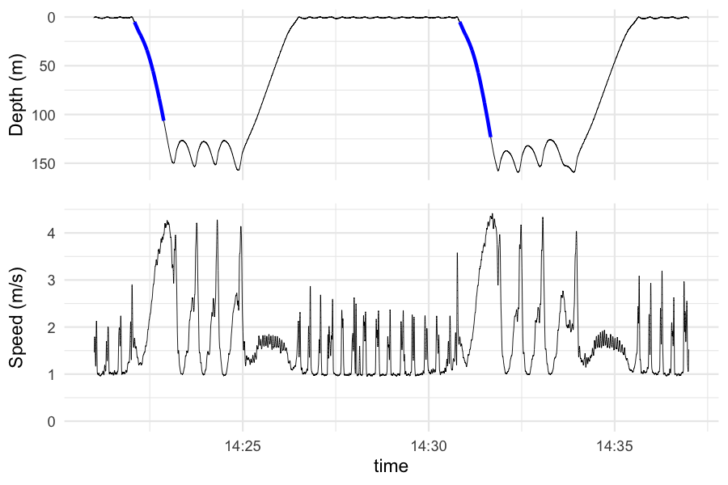

<!-- README.md is generated from README.Rmd. Please edit that file -->
The speed of an animal is an important quantity in understanding energetics, biomechanics, and fine-scale predator-prey interactions. Animal-attached devices, also called tags or bio-loggers, have limited ability to measure speed directly. However, in aquatic environments, the signal noise in high sampling rate accelerometers (the "jiggle") grows exponentially with forward speed. Regressing known speeds against the magnitude of the jiggle allows one to estimate the animal's speed during the entire deployment. For more details, see:

Cade, D. E., Barr, K. R., Calambokidis, J., Friedlaender, A. S. & Goldbogen, J. A. Determining forward speed from accelerometer jiggle in aquatic environments. *Journal of Experimental Biology* **221**, jeb170449 (2018).

Calculating known speed
-----------------------

The first step in estimating speed for the entire deployment is identifying periods of known speed. During steep descents, the change in depth multiplied by the sine of the animal's pitch (orientation-corrected depth rate, OCDR) is a good approximation of forward speed. `jgl_desc` and `jgl_ocdr` find steep descent periods and calculate OCDR. If you have `cowplot` installed, you can use `plot_desc` and `plot_ocdr` to visualize the results. Here's an example using example data from a blue whale tagged in Monterey Bay in 2016.

``` r
library(jiggle)
desc <- jgl_desc(prh_expl)
plot_desc(desc)
```



OCDR is only calculated during descents. In these two dives, OCDR increased with depth up to 4.5 m/s.

``` r
ocdr <- jgl_ocdr(desc)
plot_ocdr(ocdr)
```



Calculating the "jiggle"
------------------------

The jiggle method requires high-sampling rate acceleration, at least 100 Hz and preferably greater than 200 Hz. The "jiggle" happens in the high frequency portion of the signal, so we use a band-pass filter (by default 10 - 90 Hz) to isolate the noise. Similar to OCDR, the jiggle increases during descent. Other peaks in the jiggle line up with wiggles in the depth profile, which are associated with high-speed maneuvers.

``` r
filt <- jgl_filtacc(Araw_expl)
plot_filt(filt, prh_expl)
```



Plotting OCDR against the jiggle shows speed increases exponentially.

``` r
rms <- jgl_accrms(ocdr, filt)
plot_rms(rms)
```



Predicting speed
----------------

With OCDR and the jiggle, we fit a multivariate exponential regression:


Where *J*<sub>*x*</sub>, *J*<sub>*y*</sub>, and *J*<sub>*z*</sub> are the jiggle in each axis and *a*, *b*, *c*<sub>1</sub>, *c*<sub>2</sub>, and *c*<sub>3</sub> are the model coefficients. Using this model, we can estimate forward speed throughout the deployment.

``` r
speed <- jgl_fit(rms)
plot_speed(speed)
```


